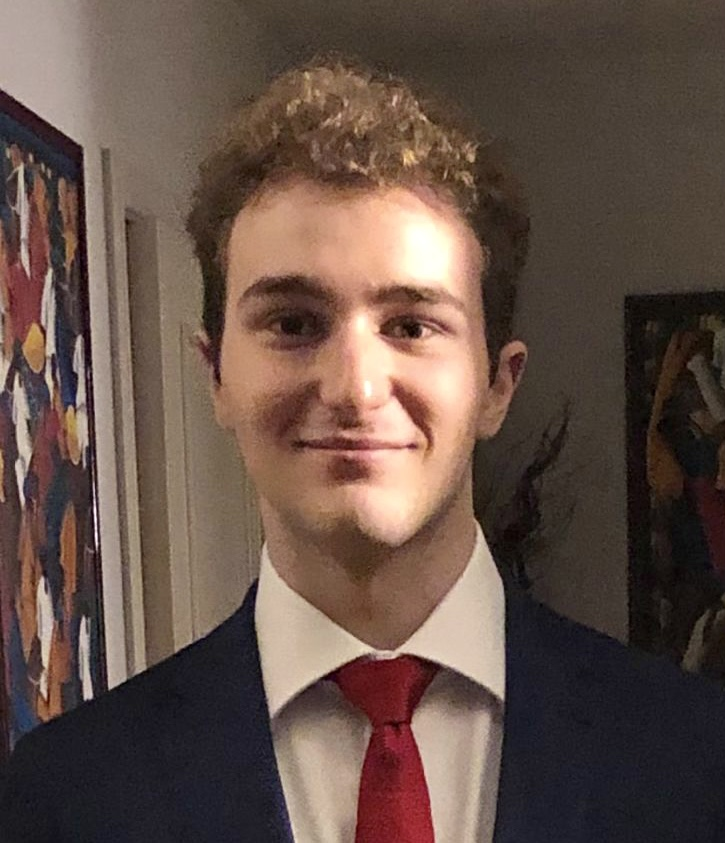

 Curriculum Vitae - Alessandro Venturini

## Informazioni Personali

> |||
> |-----------------------|---------------------------|
> |Nome                   |**Alessandro Venturini**|
> |Data di Nascita        |**21/08/2000**|
> |Nazionalità            |**Italiana**|
> |Indirizzo              |**Via Riva di Reno 126 (Bologna)**|
> |E-mail                 |**ales.ventus21@gmail.com**|
> |Telefono               |**331 3534898**|
> |GitHub                 |**[Ventus218](https://github.com/Ventus218)**|
>

## Esperienza Lavorativa

##### Ad Oggi
> Nessuna

## Istruzione e Formazione

##### *Luglio 2019*
> Diploma presso Liceo Scientifico Augusto Righi di Bologna

##### *Settembre 2019 - Settembre 2021*
> Studio presso il corso di Ingegneria Informatica all'Università di Bologna

##### *Settembre 2021 - ad Oggi*
> Studio presso il corso di Ingegneria e Scienze Informatiche nella sede di Cesena dell'Università di Bologna

## Capacità ed Esperienze Personali

##### Madrelingua
> Italiano

   

##### Altre lingue
> |Inglese|Livello|
> |------------------------------------|-----------|
> |Capacità di Lettura                 |**Molto Buono**|
> |Capacità di Scrittura               |**Molto Buono**|
> |Capacità di Espressione Orale       |**Buono**|

##### Formazione personale
> ##### *Settembre 2018 - ad Oggi*
> Partecipazione al percorso continuo di formazione *Soft Skills Academy*

## Competenze Informatiche

##### Linguaggi di Programmazione, Markup e Stile
> |Linguaggio|Livello|
> |---------------------|-----------|
> |Swift                |**Ottimo**|
> |Java                 |**Molto Buono**|
> |C                    |**Molto Buono**|
> |SQL                  |**Molto Buono**|
> |Shell                |**Molto Buono**|
> |Python               |**Buono**|
> |C#                   |**Base**|
> |HTML                 |**Base**|
> |Markdown (.md)       |**Base**|
> |CSS                  |**Base**|
> |Typescript           |**Base**|

##### Tecnologie
> - Sistemi Operativi:
>   - MacOS
>   - Linux
>   - Windows
>
> - DBMS:
>   - PostgreSQL
>   - MySQL
>   - DB2
>
> - IDE:
>   - XCode
>   - VisualStudio
>   - VisualStudioCode
>   - IntelliJ IDEA
>   - Eclipse
>   - DataGrip
>
> - Framework:
>   - SwiftUI (iOS)
>   - UIKit (iOS)
>   - [Vapor](https://github.com/vapor/vapor) (Sever Side Swift)
>   - JavaFX (Base)
>
> - Git
>
> - Docker (Base)
>
> - VirtualBox (Base)

## Progetti Universitari e Personali

### [Salus Carichi](https://salus-carichi.ddns.net) (Personale)
> Duo di applicazioni iOS (e relativo backend) sviluppate per andare a migliorare il processo di lavoro, l'organizzazione delle spedizioni, e ridurre il numero di errori umani all'interno di un'azienda di distribuzione di bevande (azienda di famiglia)

### [SwiftVersionDetector](https://github.com/Ventus218/SwiftVersionDetector) (Personale)
> Utility per ottenere a runtime la versione installata di Swift

### [F1antasy](https://github.com/Ventus218/F1antasy-App) (Universitario)
> Gioco della categoria *fantasy* sul mondo della Formula 1

### [Drones](https://github.com/Ventus218/NetworkProgramming-Drones) (Universitario)
> Sistema che simula la comunicazione tra un client, un gateway e dei droni per le spedizioni. Si è in parte emulato il funzionamento del protocollo TCP attraverso l'utilizzo del protocollo UDP (solo a scopo didattico)

## Altro

##### Patente
> B (Automunito)

##### Informazioni su di me
> Sono innamorato dell'Informatica. Sono curioso, tenace e tengo tanto a mettere sempre qualcosa di mio in ciò che faccio.
> 
> Mi piace stringere bei rapporti con le persone che ho attorno.